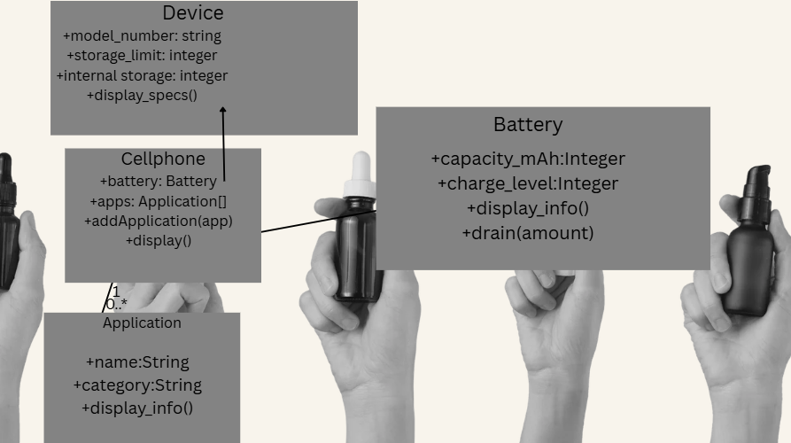
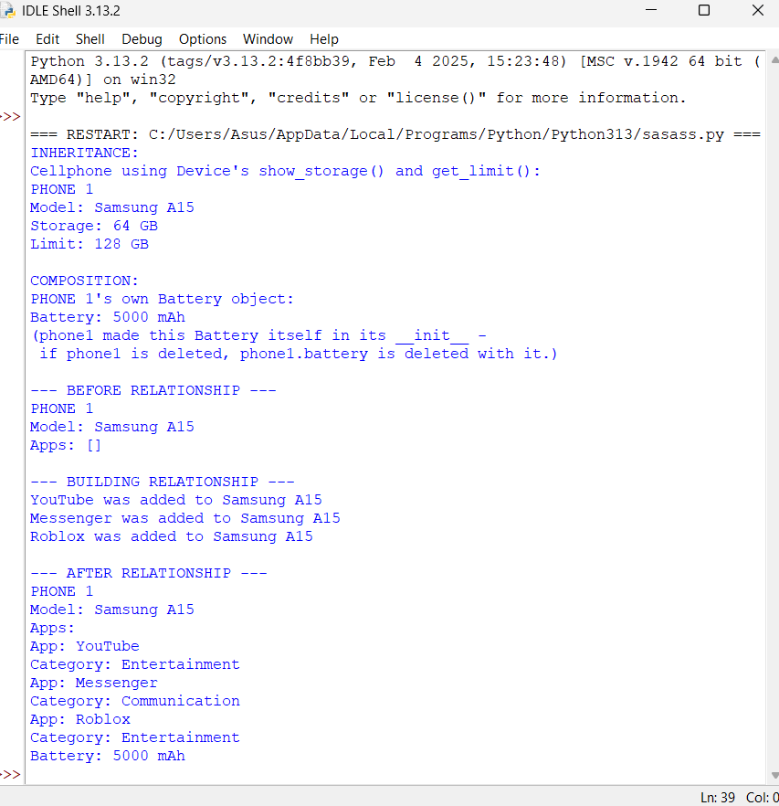
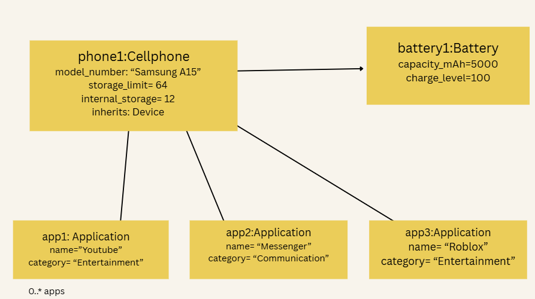

# Advanced Class Relationships
## Previous Activities

[View my OOPAct-1](https://github.com/cmxz67/9siliconcs3/blob/main/CS3-Portfolio/Quarter%201/classObjectUML.md)

[View my OOPAct-2](https://github.com/cmxz67/9siliconcs3/blob/main/CS3-Portfolio/Quarter%201/classAttributesMethods.md)

[View my OOPAct-3](https://github.com/cmxz67/9siliconcs3/blob/main/CS3-Portfolio/Quarter%201/classRelationships.md)

## Existing System Description:
From Part III, the system has two classes: Cellphone and Application, connected by a one-to-many association. Cellphone stores a list of Application objects, and each Application has a name and category. The limitation was that every device-like class would need to repeat the same base attributes, and there was no way to model a part that truly belongs to the phone.

## Inheritance Relationship
Parent: Device
Child: Cellphone
Explanation: Device holds the general attributes every device shares - model_number, storage_limit, and internal_storage— plus a display_specs() method. Cellphone is a Device: it is a specific kind of device that additionally manages a battery and a list of installed apps. Instead of re-typing those shared attributes in Cellphone, I just tell it to borrow Device's setup code.

## Inheritance UML

## Composition/Aggregation
Relationship:  Composition — Cellphone (whole) contains Battery (part)
Explanation: A Cellphone creates its own Battery inside __init__() (self.battery = Battery(battery_capacity)) - the battery is never passed in from outside. This is a HAS-A relationship: the Battery object has no meaning or existence outside of the specific phone that made it. If the Cellphone object is deleted, its Battery goes with it.
## Advanced UML Diagram
png
## Python Implementation
(https://github.com/cmxz67/9siliconcs3/blob/main/CS3-Portfolio/Quarter%201/advancedRelationships.py)
## Test Run

## Object Diagram
mage.png

## Reflection
Answers:
1. Why did you choose your inheritance relationship?
Cellphone is a Device because a cellphone really is a kind of device -- it has everything a device has (model, storage, __limit) plus extra stuff a phone specifically needs (apps, battery). "A Cellphone is a Device" makes sense; "a Device is a Cellphone" doesn't, since other devices could exist that aren't phones.

2. How did inheritance reduce duplicate code?
Before, if I made another device type later, I'd have to copy model, storage, __limit, show_storage(), and get_limit() into it too. Now that code only lives once in Device, and Cellphone just borrows it with super().__init__() instead of retyping it.

3. Why is your HAS-A relationship Composition?
The Battery gets made by the Cellphone itself, right when the phone is created -- nobody hands it a battery from outside. It lives and dies with its phone. That's what makes it composition instead of the weaker aggregation, where the part could still exist on its own.

4. What's the difference between the Association from Part III and this new relationship?
The Cellphone-App link is just that -- a link. The App objects already exist on their own and get added in from outside (add_app()), so they could outlive the phone. Composition is stronger: the Cellphone actually builds the Battery itself, so they share one lifecycle. Inheritance is different again -- it's not "has a," it's "is a," and it lets Cellphone reuse Device's code directly instead of linking to it.

5. How does your design follow the DRY principle?
model, storage, __limit, show_storage(), and get_limit() are now written once, in Device. Cellphone reuses them instead of copy-pasting, so if I ever need to change how storage works, I only change it in one place.
