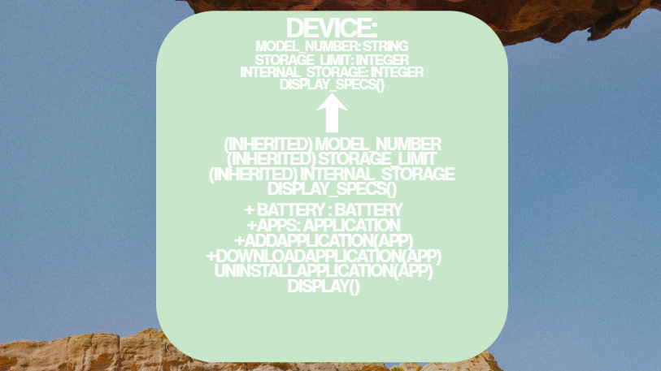

# Advanced Class Relationships
## Previous Activities

[View my OOPAct-1](https://github.com/cmxz67/9siliconcs3/blob/main/CS3-Portfolio/Quarter%201/classObjectUML.md)

[View my OOPAct-2](https://github.com/cmxz67/9siliconcs3/blob/main/CS3-Portfolio/Quarter%201/classAttributesMethods.md)

[View my OOPAct-3](https://github.com/cmxz67/9siliconcs3/blob/main/CS3-Portfolio/Quarter%201/classRelationships.md)

## Existing System Description:
From Part III, the system has two classes: Cellphone and Application, connected by a one-to-many association. Cellphone stores a list of Application objects, and each Application has a name and category. The limitation was that every device-like class would need to repeat the same base attributes, and there was no way to model a part that truly belongs to the phone.

## Inheritance Relationship
Parent: Device
Child: Cellphone
Explanation: Device holds the general attributes every device shares - model_number, storage_limit, and internal_storage— plus a display_specs() method. Cellphone is a Device: it is a specific kind of device that additionally manages a battery and a list of installed apps. Instead of re-typing those shared attributes in Cellphone, I just tell it to borrow Device's setup code.

## Inheritance UML

## Composition/Aggregation
Relationship:  Composition — Cellphone (whole) contains Battery (part)
Explanation: A Cellphone creates its own Battery inside __init__() (self.battery = Battery(battery_capacity)) - the battery is never passed in from outside. This is a HAS-A relationship: the Battery object has no meaning or existence outside of the specific phone that made it. If the Cellphone object is deleted, its Battery goes with it.
## Advanced UML Diagram

## Python Implementation
[Source Code](advancedRelationships.py)
## Test Run

## Object Diagram

## Reflection
Answers: