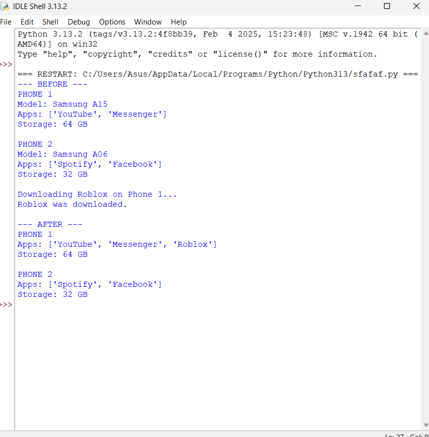
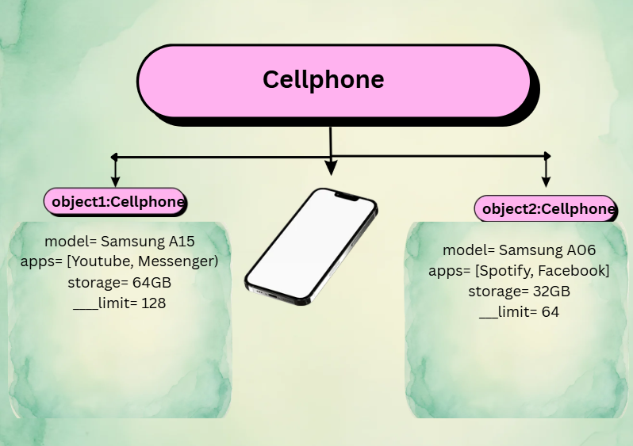

# Previous Design
- link to my previous design: [OOPAct-1](https://github.com/cmxz67/9siliconcs3/blob/main/CS3-Portfolio/Quarter%201/classObjectUML.md)

# Design Revision
- There were no major changes needed from my original design.

# Visibility Decisions
| Attribute | Description | Visibility | Why Public or Private? |
|---|---|---|---|
| Storage_Limit | Boolean | Private | The storage limit should be controlled by the cellphone and not changed directly. |
| Model_Number | Integer | Public | The model number is basic information about the cellphone and can be accessed easily. | 
| Applications | String | Public | The applications can be viewed and accessed by the user. |
| Internal_Storage | Integer | Private | The storage amount should not be changed directly because it affects the cellphone's available space. |

# Updated UML Class Diagram

# Python Implementation
[Python-Code](https://github.com/cmxz67/9siliconcs3/blob/main/CS3-Portfolio/Quarter%201/classImplementation.py)

# Test: 

# Object Diagram:

# Analysis
## Why did you make your chosen attribute private?
- I made the storage limit private because it should be controlled by the cellphone rather than changed directly by the user. This helps protect the value and demonstrates encapsulation.
## Which method changes the state of your object?
- The downloadApplication() method changes the state of the object because it adds a new application to the cellphone's apps list.
## How did your two objects demonstrate that instances are independent?
- The two objects are independent because each cellphone has its own model, applications, storage, and storage limit. For example, downloading an app to phone1 only changes phone1's apps and does not affect phone2.
## What is the difference between your class diagram and your object diagram?
- The class diagram shows the blueprint of the Cellphone class, including its attributes, visibility, and methods. The object diagram shows actual instances of the class, such as phone1 and phone2, with their specific values.