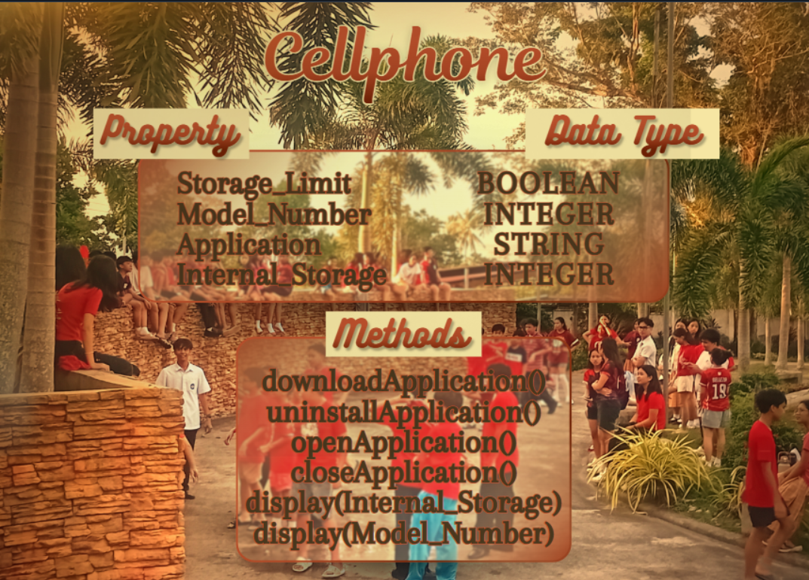

# Previous Design
- link to my previous design: [OOPAct-1](https://github.com/cmxz67/9siliconcs3/blob/main/CS3-Portfolio/Quarter%201/classObjectUML.md)

# Design Revision
- There were no major changes needed from my original design.

# Visibility Decisions
- | Attribute | Description | Visibility | Why Public or Private? |
|---|---|---|---|
| Storage_Limit | Boolean | Private | The storage limit should be controlled by the cellphone and not changed directly. |
| Model_Number | Integer | Public | The model number is basic information about the cellphone and can be accessed easily. | 
| Applications | String | Public | The applications can be viewed and accessed by the user. |
| Internal_Storage | Integer | Private | The storage amount should not be changed directly because it affects the cellphone's available space. |

# Updated UML Class Diagram

# Python Implementation
