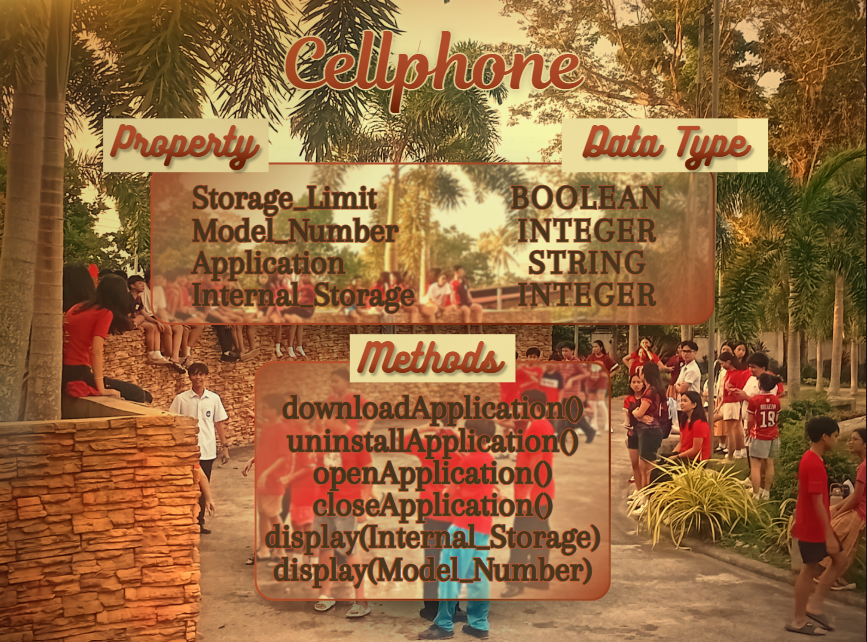

# SG4 - Understanding Classes and Objects
## Class
# - classCellphone
## Class Description
# - My class represents a technology that can be used for communication, for entertainment, and for computations.
## Properties
| Property | Data Type | Description |
|---|---|---|
| Storage_Limit | Boolean | This property decides whether the phone has enough storage or not. |
| Model_Number | Integer | This identifies a specific device variant. |
| Applications | String | This makes the cellphone a multi-functional tool for specific tasks. |
| Internal_Storage | Integer | This is the cellphone's long-term space. |
## Methods
| Method | Description |
|---|---|
| downloadApplication() | It downloads an application selected by the user. |
| uninstallApplication() | It uninstalls an application selected by the user. |
| openApplication() | It opens an application selected by the user. |
| closeApplication() | It closes an application last opened by the user. |
| display(Internal_Storage) | It displays the amount of internal storage left. |
| display(Model_Number) | It displays the model number of the Cellphone. |
## Class Diagram

## Design Explanation
### Why did you choose this class?
- I chose the Cellphone class because it is something I use regularly, so its properties and functions are easier to identify and explain. A cellphone is not limited to just one purpose. Depending on the applications installed, it can be used for messaging, schoolwork, games, watching videos, and many other activities. Because of this, I could clearly connect its features to properties and its actions to methods.
### Which property is the most important? Why?
- I consider Internal_Storage the most important property because it affects what the cellphone can actually hold. Applications, photos, videos, and other files all take up storage space. Even if a cellphone has many features, they become limited when there is not enough storage left to download or save anything.
### Which method is the most useful? Why?
- The downloadApplication() method is the most useful because it allows the cellphone to gain new functions. For example, downloading a messaging app allows communication, while downloading an educational app can help with schoolwork. The applications installed on the cellphone largely determine how the user can use the device.