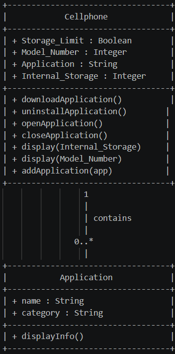
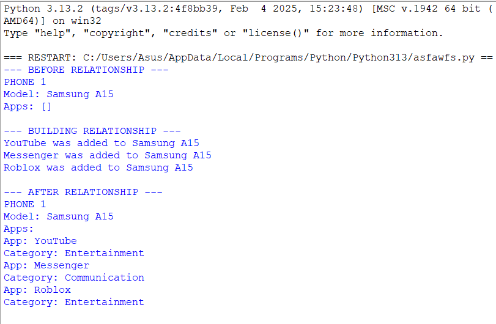
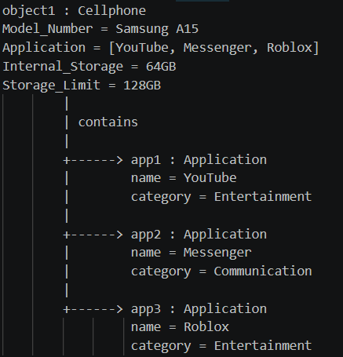

# Class Relationships: Association and Multiplicity
## Previous Work
[Part I - Classes and Objects](https://github.com/cmxz67/9siliconcs3/blob/main/CS3-Portfolio/Quarter%201/classObjectUML.md)
[Part II - Class Attributes and Methods](https://github.com/cmxz67/9siliconcs3/blob/main/CS3-Portfolio/Quarter%201/classAttributesMethods.md)
## Existing Class
Class: Cellphone
Description:It represents a cellphone that can be used for communication, entertainment, schoolwork, and other tasks. It also has different features and applications that the user can access.
## New Related Class
Class: Application
Description: It represents an application that can be installed on a cellphone. It stores information about the application and what it is mainly used for.
## Association
Relationship: Cellphone contains Application
Explanation: A cellphone can contain applications that the user downloads and uses. The cellphone keeps track of these applications so they can be accessed or managed.
## Multiplicity
Multiplicity: 0..* (One-to-Many)
Explanation: One cellphone can have zero or more applications installed. This fits because a cellphone can have many applications, and the user can add or remove them whenever they want.
## UML Class Relationship Diagram

## Python Implementation
[View Python Source](https://github.com/cmxz67/9siliconcs3/blob/main/CS3-Portfolio/Quarter%201/classRelationships.py)
## Test Run

## Object Relationship Diagram

## Analysis
### What is the association between your two classes?
- Cellphone contains and manages Application objects. The applications are connected to the cellphone so the user can access and use them through the device.
### What multiplicity did you choose and why?
- I chose One-to-Many. One cellphone can have zero or more applications installed. This fits because a cellphone can have many applications, and the user can keep downloading or uninstalling them.
### How did you implement the relationship in Python?
- - I used a list called self.apps inside the Cellphone class to store the Application objects. The addApplication() method adds an Application object to the list, which connects the cellphone to its applications.
### Why did you store an object reference instead of copying its data?
- - I stored the Application object itself so I can access its name and category directly through the cellphone. This avoids copying the same information into the Cellphone class and keeps the Application data in its own object.
### If your relationship uses many, why is a list appropriate?
- A list is appropriate because one cellphone can have many applications. It stores the actual Application objects, so I can loop through them and access the information of each application.